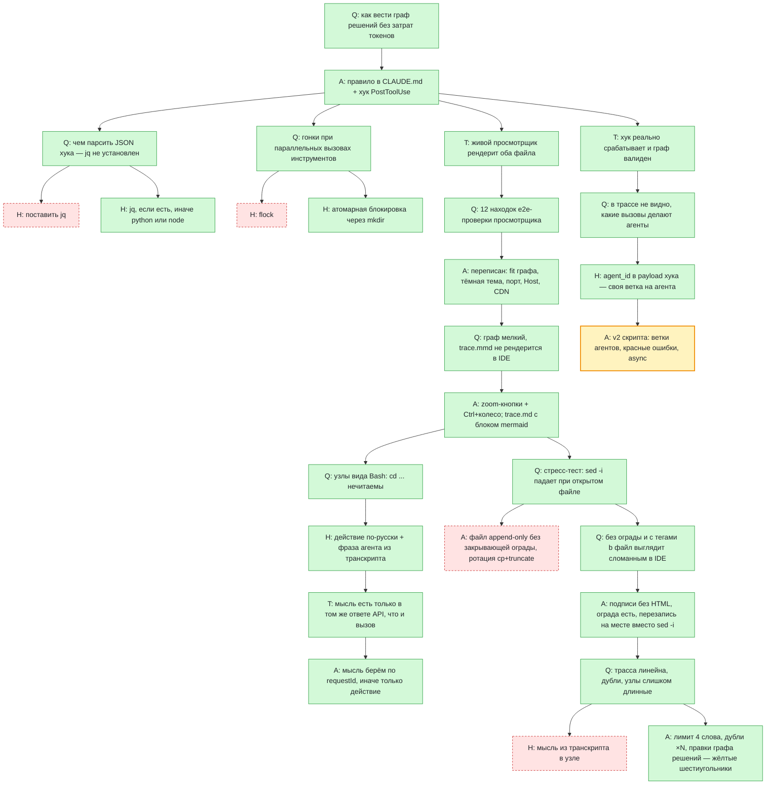

# Задача: настроить граф решений + трассировку действий

```mermaid
flowchart TD
  classDef active fill:#fff3bf,stroke:#f08c00,stroke-width:2px,color:#212529
  classDef done fill:#d3f9d8,stroke:#2f9e44,color:#212529
  classDef rejected fill:#ffe3e3,stroke:#c92a2a,stroke-dasharray:4 3,color:#212529

  Q1["Q: как вести граф решений без затрат токенов"]:::done
  Q1 --> A1["A: правило в CLAUDE.md + хук PostToolUse"]:::done
  A1 --> Q2["Q: чем парсить JSON хука — jq не установлен"]:::done
  Q2 --> H1["H: поставить jq"]:::rejected
  Q2 --> H2["H: jq, если есть, иначе python или node"]:::done
  A1 --> Q3["Q: гонки при параллельных вызовах инструментов"]:::done
  Q3 --> H3["H: flock"]:::rejected
  Q3 --> H4["H: атомарная блокировка через mkdir"]:::done
  A1 --> T1["T: хук реально срабатывает и граф валиден"]:::done
  A1 --> T2["T: живой просмотрщик рендерит оба файла"]:::done
  T2 --> Q5["Q: 12 находок e2e-проверки просмотрщика"]:::done
  Q5 --> A3["A: переписан: fit графа, тёмная тема, порт, Host, CDN"]:::done
  A3 --> Q6["Q: граф мелкий, trace.mmd не рендерится в IDE"]:::done
  Q6 --> A4["A: zoom-кнопки + Ctrl+колесо; trace.md с блоком mermaid"]:::done
  A4 --> Q7["Q: узлы вида Bash: cd ... нечитаемы"]:::done
  Q7 --> H6["H: действие по-русски + фраза агента из транскрипта"]:::done
  H6 --> T3["T: мысль есть только в том же ответе API, что и вызов"]:::done
  T3 --> A5["A: мысль берём по requestId, иначе только действие"]:::done
  A4 --> Q8["Q: стресс-тест: sed -i падает при открытом файле"]:::done
  Q8 --> A6["A: файл append-only без закрывающей ограды, ротация cp+truncate"]:::rejected
  Q8 --> Q9["Q: без ограды и с тегами b файл выглядит сломанным в IDE"]:::done
  Q9 --> A7["A: подписи без HTML, ограда есть, перезапись на месте вместо sed -i"]:::done
  A7 --> Q10["Q: трасса линейна, дубли, узлы слишком длинные"]:::done
  Q10 --> H8["H: мысль из транскрипта в узле"]:::rejected
  Q10 --> A8["A: лимит 4 слова, дубли ×N, правки графа решений — жёлтые шестиугольники"]:::done
  T1 --> Q4["Q: в трассе не видно, какие вызовы делают агенты"]:::done
  Q4 --> H5["H: agent_id в payload хука — своя ветка на агента"]:::done
  H5 --> A2["A: v2 скрипта: ветки агентов, красные ошибки, async"]:::active
```
