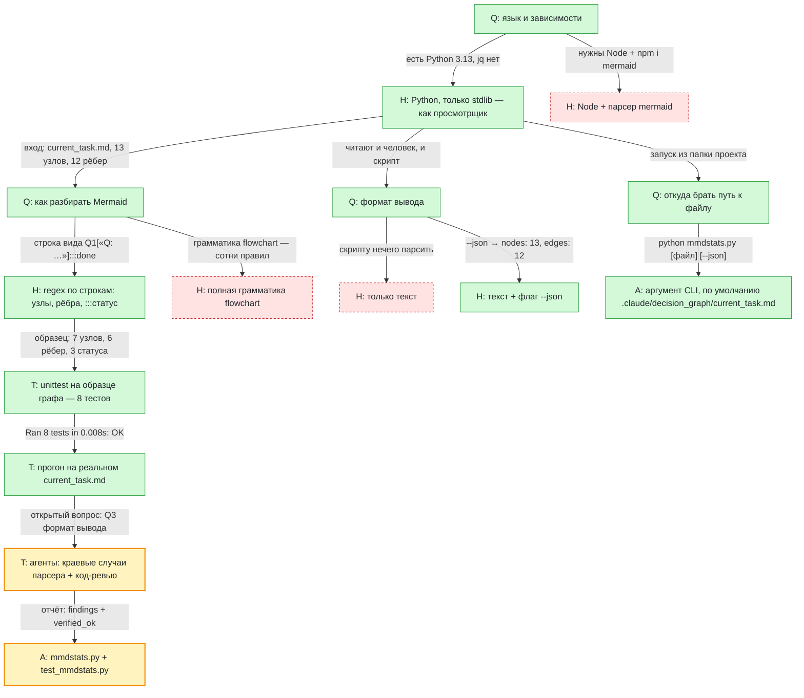

# Задача: утилита mmdstats — статистика по графу решений

Цель: CLI, который читает граф из `current_task.md` и печатает открытые вопросы,
отвергнутые гипотезы, счётчики по типам/статусам и самую длинную цепочку.

Цвета: жёлтый — в работе, зелёный — принято, красный пунктир — отвергнуто. На стрелках — данные, которые перешли дальше.

