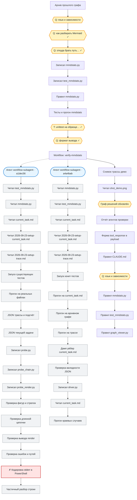

# Трасса действий

_Пишет хук action_trace.sh — не редактировать вручную._

```mermaid
flowchart TD
  classDef agentHead fill:#e7f5ff,stroke:#1c7ed6,stroke-width:2px,color:#212529
  classDef agentStep fill:#f1f3f5,stroke:#868e96,color:#212529
  classDef failed fill:#ffe3e3,stroke:#c92a2a,stroke-width:2px,color:#212529
  classDef decision fill:#fff3bf,stroke:#f08c00,stroke-width:2px,color:#212529
  S0["Архив прошлого графа"]
  S1{{"Q: язык и зависимости"}}:::decision
  S0 --> S1
  S2{{"Q: как разбирать Mermaid ✓"}}:::decision
  S1 --> S2
  S3{{"Q: откуда брать путь… ✓"}}:::decision
  S2 --> S3
  S4["Записал mmdstats.py"]
  S3 --> S4
  S5["Записал test_mmdstats.py"]
  S4 --> S5
  S6["Правил mmdstats.py"]
  S5 --> S6
  S7["Тесты и прогон mmdstats"]
  S6 --> S7
  S8{{"T: unittest на образце… ✓"}}:::decision
  S7 --> S8
  S9{{"Q: формат вывода ✓"}}:::decision
  S8 --> S9
  S10["Workflow: verify-mmdstats"]
  S9 --> S10
  A_a4a4bab162af8a2bf(["Агент workflow-subagent · a4a4bab"]):::agentHead
  S10 -.-> A_a4a4bab162af8a2bf
  S11["Читал mmdstats.py"]:::agentStep
  A_a4a4bab162af8a2bf --> S11
  S12["Читал test_mmdstats.py"]:::agentStep
  S11 --> S12
  A_a1dec565426bf74bc(["Агент workflow-subagent · a1dec56"]):::agentHead
  S10 -.-> A_a1dec565426bf74bc
  S13["Читал test_mmdstats.py"]:::agentStep
  A_a1dec565426bf74bc --> S13
  S14["Читал mmdstats.py"]:::agentStep
  S13 --> S14
  S15["Читал current_task.md"]:::agentStep
  S12 --> S15
  S16["Читал current_task.md"]:::agentStep
  S14 --> S16
  S17["Читал 2026-09-23-setup-current_task.md"]:::agentStep
  S15 --> S17
  S18["Читал 2026-09-23-setup-current_task.md"]:::agentStep
  S16 --> S18
  S19["Читал 2026-09-23-setup-trace.md"]:::agentStep
  S17 --> S19
  S20["Читал 2026-09-23-setup-trace.md"]:::agentStep
  S18 --> S20
  S21["Запуск существующих тестов"]:::agentStep
  S20 --> S21
  S22["Прогон на реальных файлах"]:::agentStep
  S21 --> S22
  S23["JSON трассы и подсчёт"]:::agentStep
  S22 --> S23
  S24["JSON текущей задачи"]:::agentStep
  S23 --> S24
  S25["Снимок трассы демо"]
  S10 --> S25
  S26["Читал shot_demo.png"]
  S25 --> S26
  S27{{"Граф решений обновлён"}}:::decision
  S26 --> S27
  S28["Отчёт агентов проверки"]
  S27 --> S28
  S29["Запуск юнит-тестов"]:::agentStep
  S19 --> S29
  S30["Прогон на current_task.md"]:::agentStep
  S29 --> S30
  S31["Прогон на архивном графе"]:::agentStep
  S30 --> S31
  S32["Прогон на трассе"]:::agentStep
  S31 --> S32
  S33["Записал probe.py"]:::agentStep
  S24 --> S33
  S34["Записал probe_chain.py"]:::agentStep
  S33 --> S34
  S35["Дамп рёбер current_task.md"]:::agentStep
  S32 --> S35
  S36["Записал probe_render.py"]:::agentStep
  S34 --> S36
  S37["Проверка валидности JSON"]:::agentStep
  S35 --> S37
  S38["Проверка фигур и стрелок"]:::agentStep
  S36 --> S38
  S39["Проверка длинной цепочки"]:::agentStep
  S38 --> S39
  S40["Проверка вывода render"]:::agentStep
  S39 --> S40
  S41["Проверка ошибок и путей"]:::agentStep
  S40 --> S41
  S42["Записал driver.py"]:::agentStep
  S37 --> S42
  S43["Читал current_task.md"]:::agentStep
  S42 --> S43
  S44["Прогон краевых случаев"]:::agentStep
  S43 --> S44
  S45["✗ Кодировка stderr в PowerShell"]:::failed
  S41 --> S45
  S46["Частичный разбор строки"]:::agentStep
  S45 --> S46
  S47["Форма tool_response в payload"]
  S28 --> S47
  S48["Правил CLAUDE.md"]
  S47 --> S48
  S49{{"Q: язык и зависимости"}}:::decision
  S48 --> S49
  S50["Правил mmdstats.py"]
  S49 --> S50
  S51["Правил test_mmdstats.py"]
  S50 --> S51
  S52["Правил graph_viewer.py"]
  S51 --> S52
```
