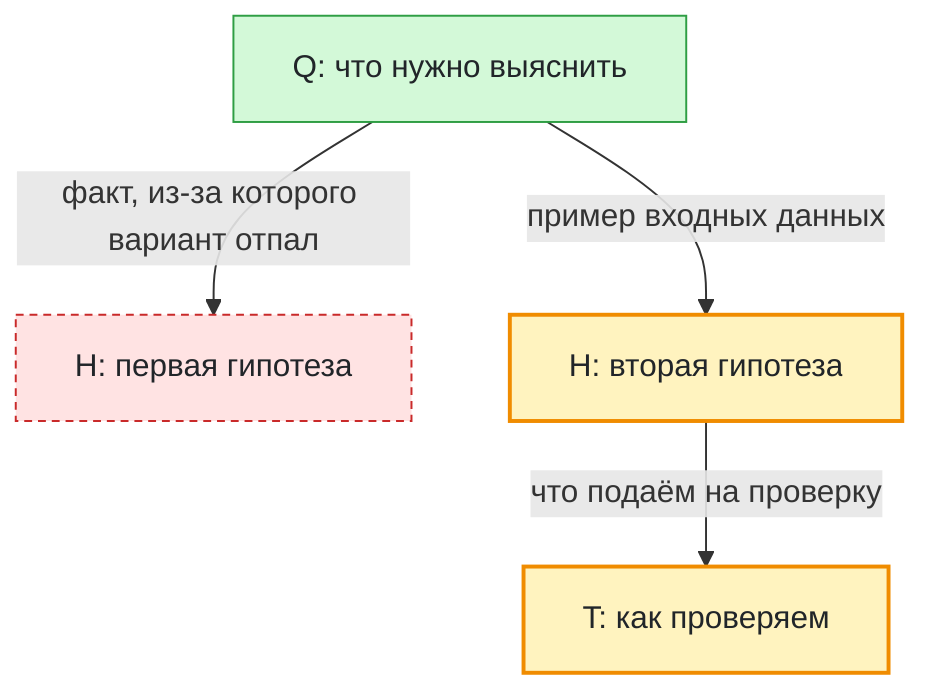

# TestMermaid

## Ведение графа решений
Для задач длиннее 3 шагов веди файл `.claude/decision_graph/current_task.md`.
Узлы: Q (вопрос), H (гипотеза), T (проверка), A (решение).
Статусы (классы Mermaid): :::active / :::done / :::rejected.
Обновляй файл точечным использованием инструмента Edit только при смене статуса или новом решении.
Обязательно поддерживай валидный синтаксис Mermaid.
После команд /clear или /compact прочитай этот файл перед продолжением работы.

Формат файла (строки `classDef` обязательны — без них статусы не подсвечиваются):

Цвета: жёлтый — в работе, зелёный — принято, красный пунктир — отвергнуто.

- На стрелках пиши **реальные данные**, которые переходят от узла к узлу: конкретный вход, результат проверки, цифры — `-->|"есть Python 3.13, jq нет"|`, `-->|"Ran 8 tests: OK"|`, `-->|"вход: current_task.md, 13 узлов"|`. Не абстракции вроде «проверка», а то, что видел на самом деле. Внутри подписи стрелки — без `"` и `|`.
- Текст узла всегда в кавычках `["..."]`, без `"` внутри — так скобки и спецсимволы не ломают синтаксис.
- Статус меняй правкой одного суффикса: `:::active` → `:::done` в строке, где узел определён. Не дописывай `X:::done` отдельной строкой — классы суммируются, а не заменяются.
- В `description` у Bash/PowerShell пиши по-русски и по-человечески, что делаешь, **максимум 4 слова** («Проверяю хук трассы», «Тесты просмотрщика») — этот текст становится узлом в `trace.md`; хук обрезает всё длиннее.
- `.claude/decision_graph/trace.md` пишет хук автоматически — не редактируй его. Смотреть его удобнее через `python ~/.claude/scripts/graph_viewer.py` (показывает хвост); после 400 шагов хук сам переносит файл в `trace.<дата>.md` и начинает новый.
